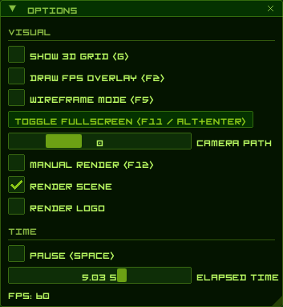

# Xbox Startup Animation

> [!NOTE]
> Web version on hold until scene rendering issues are fixed


### Build

```bash
cmake -B build
cmake --build build
```

### Demo

https://raw.githubusercontent.com/DanielLMcGuire/xbox-blob/refs/heads/master/assets/README.md_Demo_fig1.mp4

### Keybinds

| PC                  | Xbox | PS         | Action                       |
| ------------------- | ---- | ---------- | ---------------------------- |
| `~`                 | N/A  | N/A        | Toggle UI                    |
| `F2`                | N/A  | N/A        | Toggle FPS overlay           |
| `F5`                | N/A  | N/A        | Toggle wireframe             |
| `F9`                | `RS` | `R3`       | Toggle freecam               |
| `F11` / `ALT+ENTER` | N/A  | N/A        | Toggle fullscreen            |
| `F12`               | `RB` | `R1`       | Toggle manual rendering      |
| `Space`             | `Y`  | `Triangle` | Pause / resume               |
| `G`                 | N/A  | N/A        | Toggle grid                  |
| N/A                 | `RT` | `R2`       | Sprint (noclip)              |
| N/A                 | `LT` | `L2`       | Intensity (manual rendering) |
| `WASD`              | `LS` | `LS`       | Move (noclip)                |
| `Mouse`             | `RS` | `RS`       | Pan (noclip)                 |

### Options

| Short      | Long            | Description                                         |
| ---------- | --------------- | --------------------------------------------------- |
| `-c`       | `--capture`     | Render a capture                                    |
| `-path`    | `--camera-path` | Choose camera path (0 to 3, -1 = random, 0 = stock) |
| `-fs`      | `--fullscreen`  | Enter fullscreen on startup                         |
| `-na`      | `--no-audio`    | Disable audio                                       |
| `-f`       | `--fps`         | Set framerate (VSYNC if not set)                    |
| `-df`      | `--draw-fps`    | Draw FPS to screen                                  |
| `-m`       | `--msaa`        | Enable MSAA (Antialiasing)                          |
| `-g`       | `--grid`        | Show 3D grid                                        |
| `-w`       | `--wireframe`   | Enable wireframe mode on startup                    |
| `-s`       | `--seed`        | Set the RNG seed (hex, e.g. `0x76543210`)           |

Captured frames and wavfile is recorded to `frames/`. To process it (which needs FFMPEG):

```bash
# ls ./scripts/ # list hw encoder variants
./scripts/capture
# output is at ./blob.mp4
```

### UI



### Camera Paths

There are 4 camera paths

| Scene | Purpose |
| ----: | ------- |
|    -1 | Random  |
|     0 | Stock   |
| 1 - 3 | Unused  |

### Manual render mode

Manual render mode does the following:

1. Stops following the camera path (freezing camera w/o noclip)
1. Allows use of LT to adjust intensity
1. Allows use of the UI to manually control the rendering scene and logo stages

### Known issues

1. Fog is not rendered correctly, workarounds are made
1. Primitive bumpmaps and textures aren't exact yet (I have not finished them.)
1. Some audio quirks and MCPX formulas as well I will have to look into implementing correctly.

---

Original animation, audio samples, and scene data are copyright of Pipeworks Studios and/or Microsoft Corporation.

Xbox Dashboard Font is copyright of Microsoft Corporation.

I have no affilation in any form with Pipeworks Studios, Microsoft Corporation, thier affiliates or subsidiaries.
