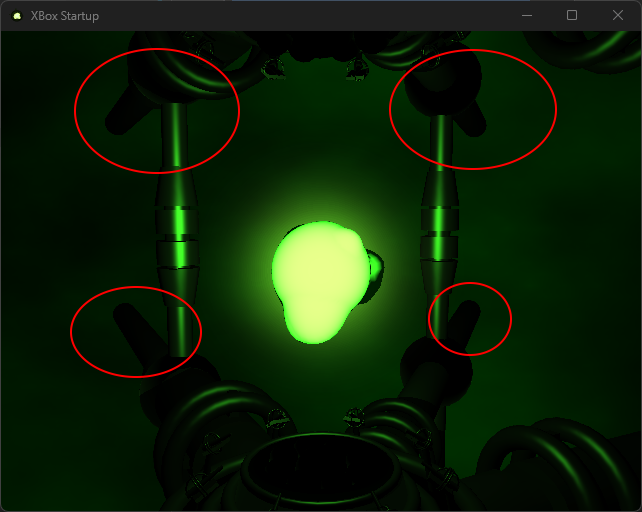

# Xbox Startup Animation

> [!NOTE]
> Web version on hold until scene rendering issues are fixed


### Build

```bash
cmake -B build
cmake --build build
```

### Demo

https://github.com/user-attachments/assets/62a48c97-93d0-4a97-8428-4f57eee9a890

### Keybinds

| Key                 | Action                    |
| ------------------- | ------------------------- |
| `~`                 | Toggle UI                 |
| `F2`                | Toggle FPS overlay        |
| `F5`                | Toggle wireframe (Desktop)|
| `F9`                | Toggle freecam            |
| `F11` / `ALT+ENTER` | Toggle fullscreen         |
| `F12`               | Toggle manual rendering   |
| `G`                 | Toggle grid               |

### Options

| Short      | Long            | Description                                         |
| ---------- | --------------- | --------------------------------------------------- |
| `-c`       | `--capture`     | Render a capture                                    |
| `-path`    | `--camera-path` | Choose camera path (0 to 3, -1 = random, 0 = stock) |
| `-fs`      | `--fullscreen`  | Enter fullscreen on startup                         |
| `-na`      | `--no-audio`    | Disable audio                                       |
| `-f`       | `--fps`         | Set framerate (VSYNC if not set)                    |
| `-df`      | `--draw-fps`    | Draw FPS to screen                                  |
| `-m`       | `--msaa`        | Enable MSAA (Antialiasing)                          |
| `-g`       | `--grid`        | Show 3D grid                                        |
| `-w`       | `--wireframe`   | Enable wireframe mode on startup                    |
| `-s`       | `--seed`        | Set the RNG seed (hex, e.g. `0x76543210`)           |

Captured frames and wavfile is recorded to `frames/`. To process it (which needs FFMPEG):

```bash
# ls ./scripts/ # list hw encoder variants
./scripts/capture
# output is at ./blob.mp4
```

### UI


### Camera Paths

There are 4 camera paths, 0 indexed (0-3)

| Scene | Purpose |
| ----: | ------- |
|    -1 | Random  |
|     0 | Stock   |
| 1 - 3 | Unused  |

### Manual render mode

Manual render mode does the following:

1. Disables the camera path
1. Enables LT to adjust intensity
1. Allows you to manually control the rendering scene and logo stages via the UI

### Known issues

1. Fog renders behind far parts of scene primitives unlike original:

    

1. Primitive bumpmaps and textures aren't exact yet (I have not finished them.)

1. Some audio quirks and MCPX formulas as well I will have to look into implementing correctly.

---

Original animation, audio samples, and scene data are copyright of Pipeworks Studios and/or Microsoft Corporation.

Xbox Dashboard Font is copyright of Microsoft Corporation.

I have no affilation in any form with Pipeworks Studios, Microsoft Corporation, thier affiliates or subsidiaries.
